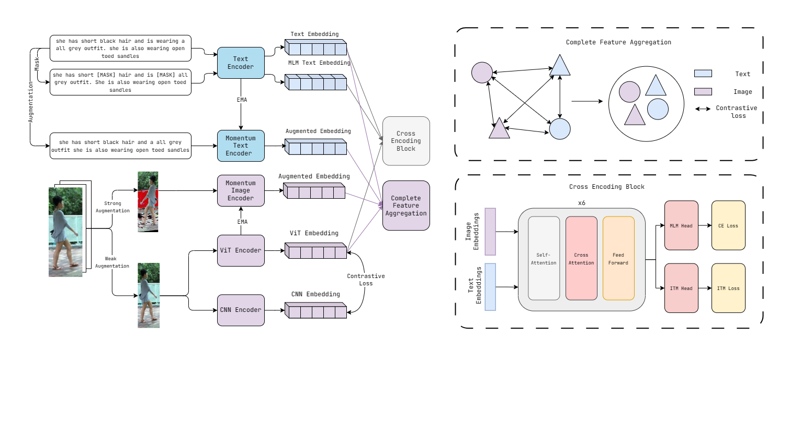

## An Efficient Framework for Text-to-Image Retrieval Using Complete Feature Aggregation and Cross-Knowledge Conversion

Official Implementation of the paper An Efficient Framework for Text-to-Image Retrieval Using Complete Feature Aggregation and Cross-Knowledge Conversion. 




### Updates
- (14/11/2023) Code released!


### Usage
#### Prepare Datasets
1. Download CUHK-PEDES dataset from [here](https://github.com/ShuangLI59/Person-Search-with-Natural-Language-Description), ICFG-PEDES dataset from [here](https://github.com/zifyloo/SSAN) and RSTPReid dataset from [here](https://github.com/NjtechCVLab/RSTPReid-Dataset).

2. Organize them in your data directory as follows:
```
|-- your dataset root dir/
|   |-- <CUHK-PEDES>/
|       |-- imgs
|           |-- cam_a
|           |-- cam_b
|           |-- ...
|       |-- reid_raw.json
|
|   |-- <ICFG-PEDES>/
|       |-- imgs
|           |-- test
|           |-- train
|       |-- ICFG-PEDES.json
|
|   |-- <RSTPReid>/
|       |-- imgs
|       |-- data_captions.json
```

3. Run the following scripts:

```
python data_process.py --dataset_name "CUHK-PEDES" --dataset_root_dir [CUHK-PEDES DIR]
python data_process.py --dataset_name "ICFG-PEDES" --dataset_root_dir [ICFG-PEDES DIR]
python data_process.py --dataset_name "RSTPReid" --dataset_root_dir [RSTPReid DIR]

```

#### Training

```
python3 Retrieval.py --config "your/config/file" --checkpoint "your/checkpoint/file" --output_dir "/your.output/file" --pick_best_r1
```

#### Checkpoints
The checkpoints can be found in this [drive](https://drive.google.com/drive/folders/1EYi2rGFmSuGQU5GRU0-nHy0ewMFQMq7M?usp=sharing)


#### Acknowledgements
This paper is sponsored by [AI VIETNAM](https://aivietnam.edu.vn/). The implementation of this paper relies on resources from [X2-VLM](https://github.com/zengyan-97/X2-VLM) and [timm](https://github.com/huggingface/pytorch-image-models/tree/main/timm). We sincerely appreciate the original authors for their open-sourcing.

#### Citation
If you finds thiscode useful for your research, please cite our paper.
